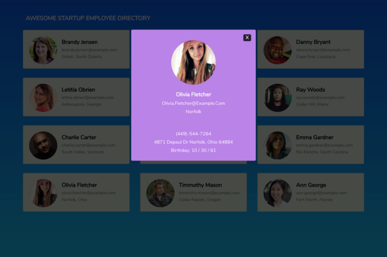

# Treehouse Public API

## Instructions
- Clone/Download the project to your local machine and open up the index.html file *OR* click [here](https://the-juan-andonly.github.io/Treehouse-Public-API/) to view the project

- The page load up 12 random users fro the [Random User API](https://randomuser.me/)

- The User will be able to see an employee image, name, email, and city
  

* When clicking on an employees card a modal will appear displaying some further information such as phone number, address, and birthday.

